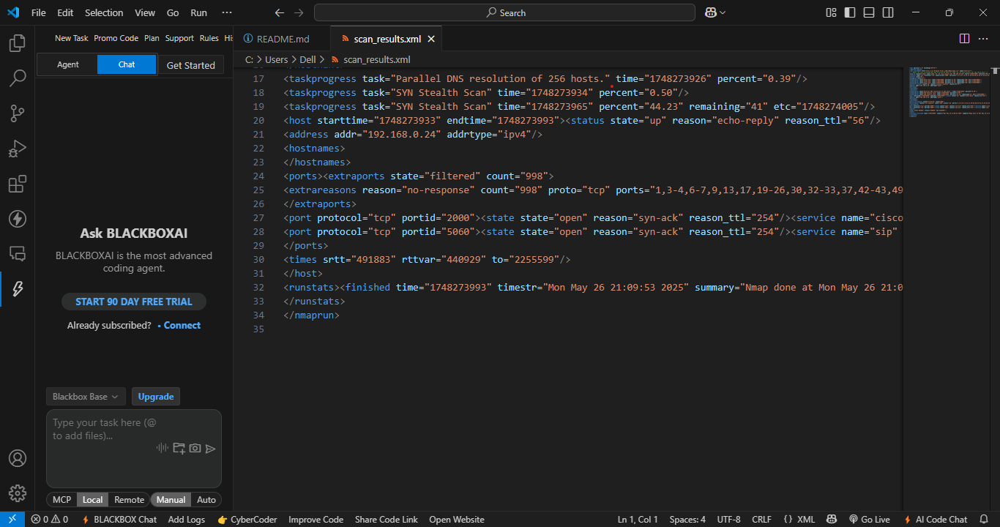

# Task 1: Local Network Port Scanning with Nmap

## Objective
To discover open ports on local network devices to understand network exposure.

##  Tools Used
- Nmap
- (Optional) Wireshark

## Steps Performed
1. Installed Nmap
2. Found local IP range (e.g., 192.168.1.0/24)
3. Performed TCP SYN scan using:
4. Noted down IP addresses and open ports
5. (Optional) Captured traffic with Wireshark
6. Researched services and identified risks

##  Output Files
- `scan_results.txt`: Text output of the scan
- `scan_results.html`: HTML version (optional)

## Screenshot

